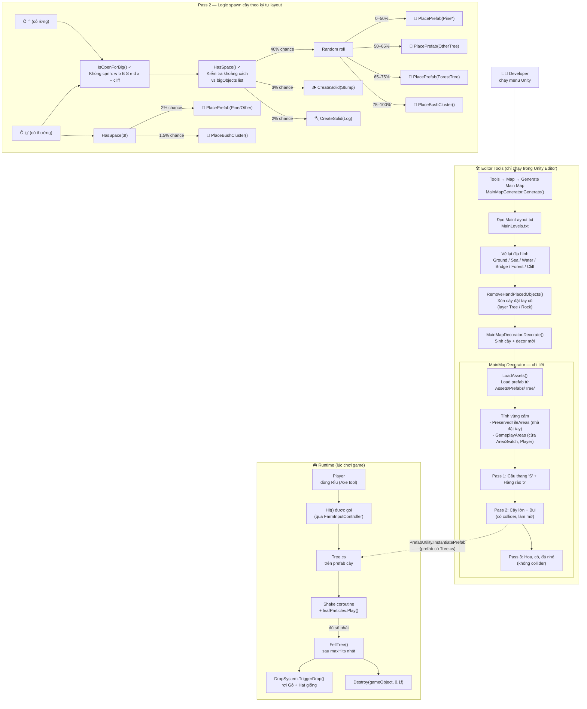

# Luồng Spawn Cây trên Map

## Tổng quan

## Các file liên quan

| File | Vai trò |
|---|---|
| [`MainLayout.txt`](file:///d:/Game_Project/Totnghiep2026/Assets/MapLayout/MainLayout.txt) | Bản đồ ký tự định nghĩa loại ô (`f`, `g`, `w`...) |
| [`MainMapGenerator.cs`](file:///d:/Game_Project/Totnghiep2026/Assets/Editor/MainMapGenerator.cs) | Entry point: vẽ địa hình → gọi Decorator |
| [`MainMapDecorator.cs`](file:///d:/Game_Project/Totnghiep2026/Assets/Editor/MainMapDecorator.cs) | Sinh cây/bụi/decor theo random seed |
| [`Assets/Prefabs/Tree/`](file:///d:/Game_Project/Totnghiep2026/Assets/Prefabs/Tree) | Prefab Pine, OtherTree, ForestTree, Bush |
| [`Tree.cs`](file:///d:/Game_Project/Totnghiep2026/Assets/Scripts/Tree.cs) | Runtime: xử lý chặt cây → rơi item |
| [`TreeFade.cs`](file:///d:/Game_Project/Totnghiep2026/Assets/Scripts/TreeFade.cs) | Làm mờ cây khi player đứng sau |
